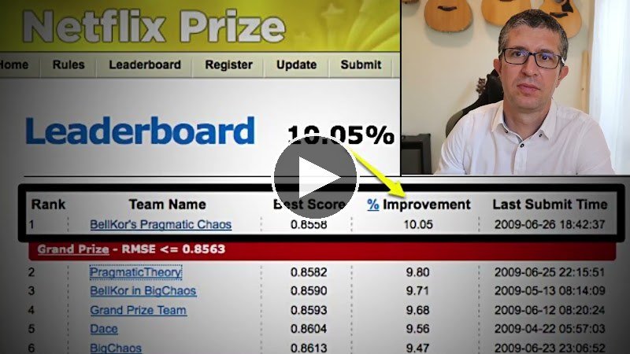

The goal of this project is to revisit the Netflix Prize problem, solve it with modern tools, and surpass the previous best result achieved by the Grand Prize winners back in 2009.

## Demo video

[](https://drive.google.com/file/d/1v7Nvz7EGfXDIBADgBS-sqfcoZ2ksCmEn/view?usp=sharing)

## Quickstart

### 1. Install Rust

Install the toolchain via [rustup](https://rustup.rs/):

```
curl --proto '=https' --tlsv1.2 -sSf https://sh.rustup.rs | sh
```

After installation, restart the shell (or `source "$HOME/.cargo/env"`) so that
`cargo` and `rustc` are on the `PATH`. The crate uses Rust edition 2024, so a
reasonably recent stable toolchain is required.

On Linux the BLAS backend is OpenBLAS — install the dev package, e.g.
`sudo apt install libopenblas-dev` on Debian/Ubuntu or
`sudo pacman -S openblas` on Arch/Manjaro. On macOS the Accelerate framework
is used and no extra setup is needed.

### 2. Build with cargo

All model and pipeline binaries live in `src/bin/`. Always build with
`--release` — debug builds are typically 50–100× slower and unusable for
training. The first build downloads dependencies and takes a few minutes;
subsequent builds are incremental.

```
cargo build --release                 # build the whole workspace
cargo build --release --bin run       # build a single binary
cargo build --release --bin tsvdx4-new
```

The resulting executables land in `target/release/`.

### 3. Run computations

Computations are orchestrated by the `run` binary, which reads a pipeline
manifest and runs the requested job. The first two jobs prepare the data (see
[Data](#data)): `download` fetches the raw archive, and `ingest` parses it
directly into the `.npy` arrays the rest of the pipeline consumes:

```
./target/release/run -n              # list all jobs and their status
./target/release/run -n download     # fetch the dataset archive into data/raw/
./target/release/run -n ingest       # parse the archive into data/{train,...}/
./target/release/run -n tsvdx4-64    # train a single model
```

See [Pipeline](#pipeline) below for the available flags, the two manifests,
and how job dependencies are resolved.

## Data

You do not have to download anything by hand — the `download` and `ingest` jobs
handle it.

The original Netflix Prize dataset is publicly available (no Kaggle account
required) at the Internet Archive:
https://archive.org/download/nf_prize_dataset.tar/nf_prize_dataset.tar.gz
(md5 `a8f23d2d76461211c6b4c0ca6df2547d`). The `download` job fetches it to
`data/raw/nf_prize_dataset.tar.gz` over HTTPS (with retry and
resume-on-interruption; skipped if already present) and verifies that md5. The
`ingest` job then reads that archive directly:

```
data/raw/
  nf_prize_dataset.tar.gz   # downloaded
  README                    # extracted by ingest
  movie_titles.csv          # extracted by ingest
  probe.txt                 # extracted by ingest
  qualifying.txt            # extracted by ingest
```

`ingest` extracts the small, human-readable members (`README`,
`movie_titles.csv` — renamed from `.txt` —, `probe.txt`, `qualifying.txt`) to
`data/raw/`, then parses them from there. The bulky training ratings are *not*
materialised: they ship as one `<id>:`-headed file per movie inside an inner
`training_set.tar`, and `ingest` streams those blocks straight out of the tar
(each block is self-describing, so order doesn't matter). If you already have
the archive, drop it into `data/raw/` and `download` becomes a no-op.

The qualifying-set ratings and the Quiz/Test split (in neither the Internet
Archive nor the Kaggle release) are bundled with the repo as
`data/qual_ratings/qual_ratings.csv.gz` — one row per qualifying entry in
`qualifying.txt` parse order, with columns `rating` and `is_test`
(0 = Quiz, 1 = Test). The `ingest` job reads this file directly.

## Pipeline

The pipeline is described declaratively in a TOML manifest. Each job has a
`jobtype` (`model`, `paropt`, `legacy_eblend`, ...), explicit `inputs` and
`outputs`, and a build/run command. The repo holds two manifests, one per
train/probe split:

- `pipeline-old.toml` — `data/{train,probe,fulltrain,qual}` →
  `preds/`, `features/`
- `pipeline-new.toml` — `data/{trainx,probex,fulltrain,qual}` →
  `preds_new/`, `features_new/`. Each job `<name>` has a dedicated binary
  at `src/bin/<name>-new.rs` with hardcoded config.

The orchestrator `src/bin/run.rs` reads a manifest, computes each job's
status (`READY` / `BLOCKED` / `DONE`) from file existence, and runs the
requested job:

```
./target/release/run -n              # list jobs (pipeline-new.toml)
./target/release/run -n JOB          # run JOB
./target/release/run -n -f JOB       # force re-run
./target/release/run -n -c -f        # delete preds/features files no
                                     # active job references
```

`-p FILE` selects a manifest explicitly; `-n` is a shorthand for
`-p pipeline-new.toml` (default is `pipeline-old.toml`).
